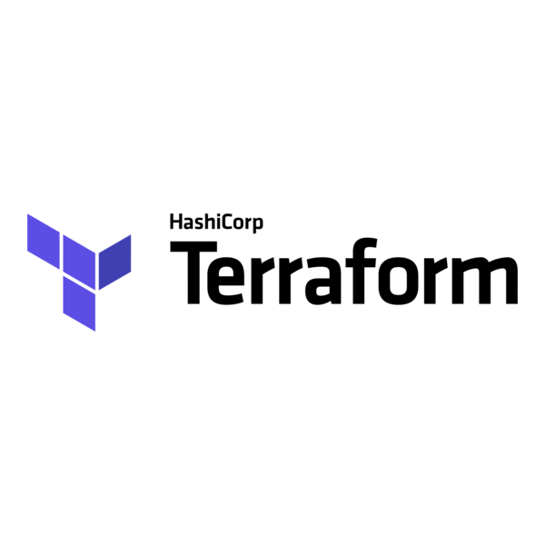

# DESPLIEGUE EN AWS

El siguiente laboratorio se enfocará en un despliegue tradicional sin balanceador de carga.
Desplegaremos una aplicación y su base de datos siguiendo las buenas prácticas más usuales en el mercado.
Entre ellas el HARDENING con Zero Trust Network Access, definición de reglas de acceso.

**NOTA:** __Todos los conceptos son consultables en la carpeta de Clase 3 donde se deja información útil para entender términos técnicos. Se sugiere tenerla a la mano como glosario__

**NOTA 2:** __No usaremos CLOUDFLARE, ya que requiere una configuración de dominio más avanazada. Si bien ese es un estándar de seguridad.__

**TIPO DE DESPLIEGUE:** __Recreate__

Apaga el contenedor funcionando e inmediatamente después inicia el de la nueva versión. Genera downtime

## PASOS PARA EL DESPLIEGUE

### 1) Crear una cuenta en AWS
Esta parte es sencilla, pero te pide una tarjeta para validarte. Puede ser prepaga.
Para la clase NO recomiendo usar facturación. El paso es solamente como referencia para que tengan en cuenta el día de mañana

### 2) Configurar las alertas y facturación

Los servicios de AWS, como los de cualquier otro proveedor, tienen una capa gratuita o bonificada para probar el producto. No está pensado para que sea eternamente gratis, ni para descuidar. Todo servicio que deje de usarse debe ser dado de baja para evitar cargos que van a seguir corriendo a pesar de que la cuenta esté dada de baja. Por lo tanto, listaremos un par de consejos a tener en cuenta:

* LAS ALERTAS NO DETIENEN LOS SERVICIOS, significa que a pesar de que pongan un límite de 0,01 dolar no detendrá los servicios. Las alertas son para avisarte de que se está produciendo un consumo por encima de lo establecido. (Caso ejemplo: si estás de vacaciones y lo ignoras durante un ataque de DoW tu billetera quedará vaciada y tendrás una deuda pendiente que no podrás afrontar. Y si tienes más servicios clave corriendo estos pueden quedar vulnerables al cierre de tu cuenta)
* EL PROVEEDOR NO ES TU AMIGO, son proveedores de servicios y no hay una forma de negociar la deuda. En google cloud platform estudiantes acumulan deudas por encima de los $10.000 USD en algunos casos por servicios olvidados y que han quedado corriendo.
* DETEN LOS SERVICIOS, cuando sepas que ya no lo seguirás usando apaga y/o elimina las instancias. En el caso de los buckets con almacenamiento destrúyelos.
* CONFIGURA ACCIONES CUANDO SE ALCANCE UN LÍMITE, puedes configurar dentro o por fuera maneras de detener los servicios o realizar determinadas acciones al notar que se llega al 90% del budget. Aquí una URL con lo que recomienda la documentación de AWS [AWS Dcoumentation - Acciones al 90% del budget](https://docs.aws.amazon.com/cost-management/latest/userguide/budgets-controls.html)
* APLICA BUENAS PRÁCTICAS, en servicios a nivel empresarial o de soluciones de producción hay que incluir cloudflare para la protección y el rechazo contra ataques.

### 3) TailScale: Crearemos una red segura

Lo que nos permitirá es crear una red de computadoras enlazadas entre las cuales pueden verse. Como una RED LAN virtual.
A fin de usar el protocolo WireGuard [WireGuard Información](https://ccnadesdecero.es/wireguard-que-es-como-funciona/)

__"Dado que WireGuard VPN cifra los datos, las entidades a lo largo de la ruta de tu VPN no podrán interceptar tu conexión. Tu ISP y actores malintencionados no podrán recuperar la información enviada a través de esa VPN. El segmento naranja etiquetado como “WireGuard VPN” en los diagramas a continuación ilustra dónde la VPN asegura los datos transmitidos. Además, una VPN de WireGuard puede proporcionar acceso seguro a recursos en una red interna."__


### 4) Crearemos el archivo TERRAFORM

Terraform es un tipo de IaaC, que significa que a través del código crearemos infraestructura

```
variable "tailscale_auth_key" {
  description = "Token efímero de Tailscale (tskey-auth-...)"
  type        = string
  sensitive   = true
}

provider "aws" {
  region = "us-east-1"
}

resource "aws_security_group" "ec2_laboratorio" {
  name        = "reglas_laboratorio_traefik"
  description = "HTTP/HTTPS abierto al mundo. SSH cerrado (Solo Tailscale)."

  ingress {
    description = "Tráfico web HTTPS directo a Traefik"
    from_port   = 443
    to_port     = 443
    protocol    = "tcp"
    cidr_blocks = ["0.0.0.0/0"]
  }

  ingress {
    description = "Tráfico web HTTP para validación de Let's Encrypt"
    from_port   = 80
    to_port     = 80
    protocol    = "tcp"
    cidr_blocks = ["0.0.0.0/0"]
  }

  # SSH (Puerto 22) en algunos casos es configurado para decir desde dónde pueden aceptarse las conexiones.
  # En nuestro caso decidimos aplicar el protocolo WireGuard

  egress {
    description = "Salida a internet para descargar contenedores y conectar Tailscale"
    from_port   = 0
    to_port     = 0
    protocol    = "-1"
    cidr_blocks = ["0.0.0.0/0"]
  }
}
#######################
# CREAMOS EL SERVIDOR #
#######################
resource "aws_instance" "servidor_lab" {
  ami           = "ami-0c7217cdde317cfec" # Ubuntu 22.04 LTS
  instance_type = "t2.micro"
  # Referenciamos las reglas de firewall
  vpc_security_group_ids = [aws_security_group.ec2_laboratorio.id]

  # Necesitamos configurar una llave .pem previamente
  key_name      = "tu_llave_aws"


  user_data = <<-EOF
              #!/bin/bash
              apt-get update -y
              apt-get install -y docker.io docker-compose-v2 awscli curl
              systemctl enable --now docker
              usermod -aG docker ubuntu

              curl -fsSL https://tailscale.com/install.sh | sh
              tailscale up --authkey=${var.tailscale_auth_key} --ssh
              EOF

  tags = {
    Name = "Nodo-Laboratorio-Traefik"
  }
}

# Al levantar el servicio nos dan una ip pública de la máquina virtual. Esa la configuramos con .nip.io
output "ip_publica" {
  description = "Usa esta IP para tu dominio gratuito en el docker-compose"
  value = aws_instance.servidor_lab.public_ip
}
```

### 5) Configuramos el dockercompose

````
services:
  traefik:
    image: traefik:v3.0
    ports:
      - "80:80"
      - "443:443"
    command:
      - "--providers.docker=true"
      - "--providers.docker.exposedbydefault=false"
      - "--entrypoints.web.address=:80"
      - "--entrypoints.websecure.address=:443"
      # Redirección forzada de HTTP a HTTPS
      - "--entrypoints.web.http.redirections.entryPoint.to=websecure"
      - "--entrypoints.web.http.redirections.entryPoint.scheme=https"
      # Configuración del Challenge de Let's Encrypt
      - "--certificatesresolvers.myle.acme.httpchallenge=true"
      - "--certificatesresolvers.myle.acme.httpchallenge.entrypoint=web"
      - "--certificatesresolvers.myle.acme.email=tu-email@empresa.com"
      - "--certificatesresolvers.myle.acme.storage=/letsencrypt/acme.json"
    volumes:
      - "/var/run/docker.sock:/var/run/docker.sock:ro"
      - "./letsencrypt:/letsencrypt"
    networks:
      - proxy_network

  frontend:
    image: ghcr.io/tu-usuario/proyecto-frontend:latest
    labels:
      - "traefik.enable=true"
      # REEMPLAZAR: Cambia 203.0.113.50 por la IP que te dio Terraform
      - "traefik.http.routers.front.rule=Host(`app.203.0.113.50.nip.io`)"
      - "traefik.http.routers.front.entrypoints=websecure"
      - "traefik.http.routers.front.tls.certresolver=myle"
    networks:
      - proxy_network

  backend:
    image: elestio/pocketbase:latest
    volumes:
      - pb_data:/pb/pb_data
    labels:
      - "traefik.enable=true"
      # REEMPLAZAR: Dominio para la API de PocketBase
      - "traefik.http.routers.back.rule=Host(`api.203.0.113.50.nip.io`)"
      - "traefik.http.routers.back.entrypoints=websecure"
      - "traefik.http.routers.back.tls.certresolver=myle"
    networks:
      - proxy_network

volumes:
  pb_data:

networks:
  proxy_network:
    external: true
```